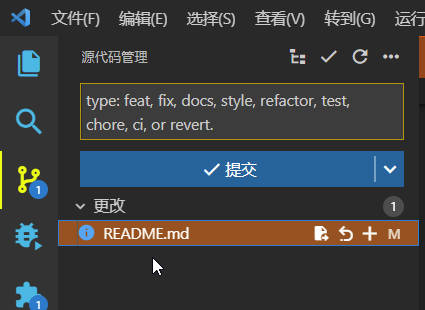

> 良好的开发习惯可以提升产品稳定性, 所以在这里记录一些比较重要的开发规范

# Commit 提交样式

格式:
```
<type>: <subject>
```

例子:
```
feat: add hat wobble
^--^  ^------------^
|     |
|     +-> Summary in present tense.
|
+-------> Type: feat, fix, docs, style, refactor, test, chore, ci, or revert.
```

更多的例子:
- feat: 产品的新特性新功能, 脚本的新功能不算
- fix: 针对用户的错误修复，而不是对构建脚本的修复
- docs: 文档的更改
- style: 格式，缺少分号等；没有生产代码更改
- refactor:重构生产代码，例如重命名变量
- test: 添加缺失的测试，重构测试；没有生产代码更改
- chore:更新繁重的任务等；没有生产代码更改
- ci: 更改为 CI 配置文件和脚本
- revert: 恢复以前的提交

> 💡 chore中"繁重的任务" 表示外部用户不会看到任何内容：
> - 实现（现有功能，不涉及修复），
> - 配置（如 或 ），.gitignore.gitattributes
> - 私有内部方法...

在 `VS Code` 里显示Commit提示信息, 新建文本文件 commit-template.txt
```
type: feat, fix, docs, style, refactor, test, chore, ci, or revert.
```

`git` 配置提示信息
```
git config --global commit.template commit-template.txt
```

这样在 `VS Code` 中则会显示提示信息, Commit更方便

